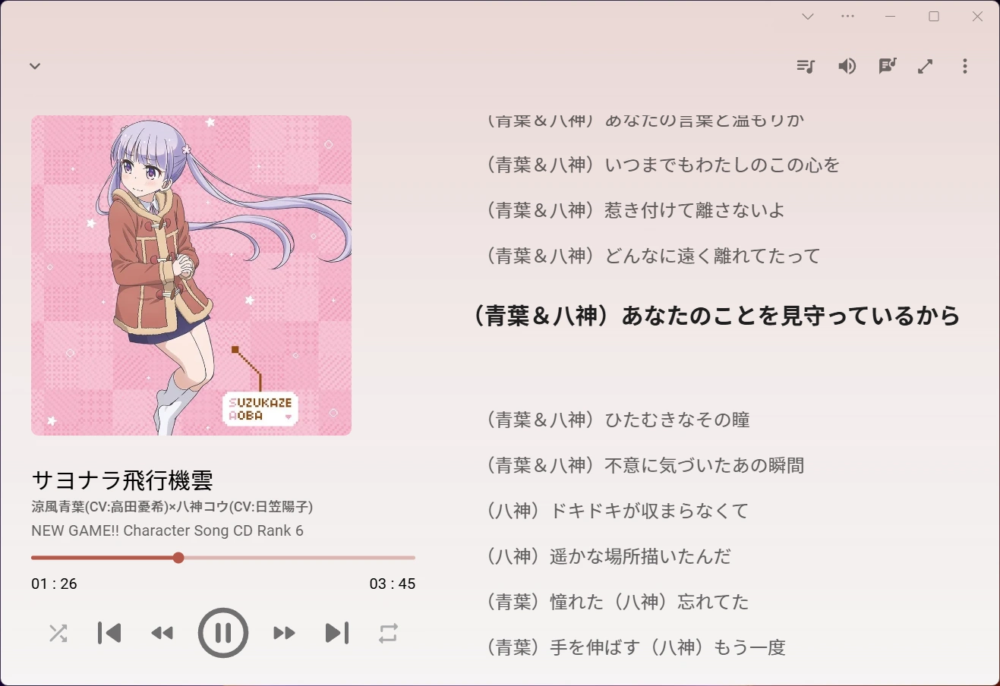
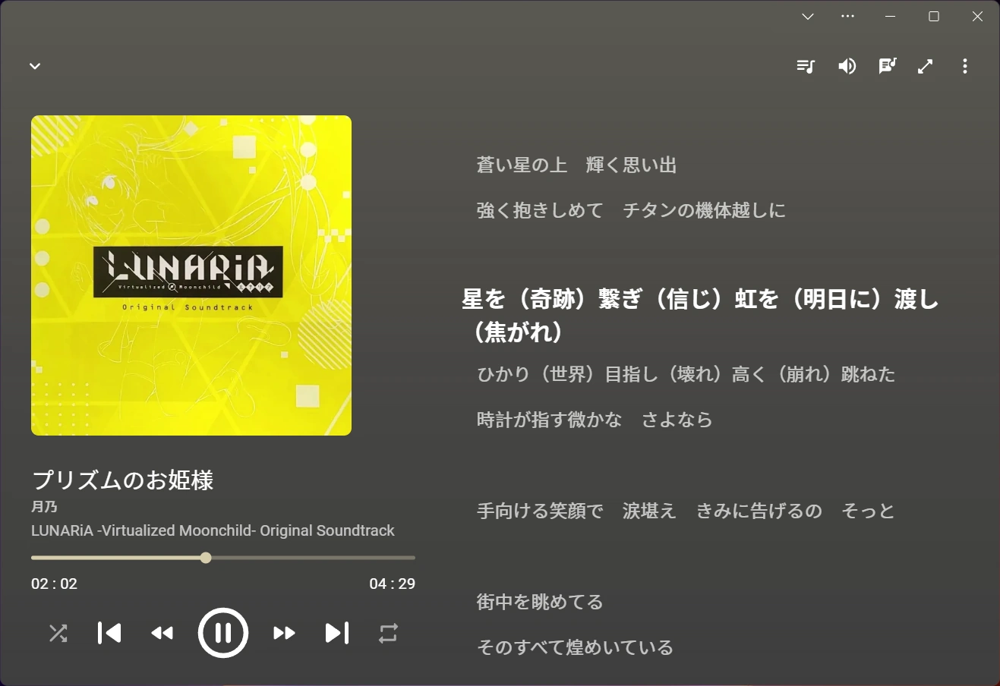

# OMP - OneDrive 媒体播放器


<a href="https://afdian.com/a/nini22P"></a>
[](https://ko-fi.com/nini22p)

[English](./readme.md) | 中文

**[立即播放](https://nini22p.github.io/omp/)**

## 功能

- [x] OneDrive 文件查看
- [x] 音乐播放
- [x] 歌词显示
- [x] 视频播放
- [x] 播放队列
- [x] 黑暗模式
- [x] Media Session
- [x] PWA
- [x] 播放历史同步
- [x] 播放列表同步

## 截图




## FAQ

### 我的数据保存在哪里？

OMP 的数据全部保存在你的 OneDrive 中的 `应用 / OMP` 文件夹中。其中 `history.json` 为历史记录，`playlists.json` 为播放列表，如果有数据丢失可以访问 OneDrive 网页版恢复旧版本数据。

## 运行和编译

### 注册应用

1. 打开 <https://portal.azure.com/>
2. 进入 `应用注册` 添加一个新应用
3. `支持账户类型` 选择第三项 (`任何组织目录中的帐户和个人 Microsoft 帐户`)
4. `重定向 URI` 选择 `SPA`, url 输入 <http://localhost:8760> 或者你部署访问的域名
5. `API 权限` 添加 `User.Read` `Files.Read` `Files.ReadWrite.AppFolder`

### 运行开发服务器

在项目路径添加 `.env.development`

```env
CLIENT_ID=<clientId>
REDIRECT_URI=http://localhost:8760
```

运行 `npm i && npm run dev`

### 本地编译

在项目路径添加 `.env`

```env
CLIENT_ID=<clientId>
REDIRECT_URI=<redirectUri>
```

运行 `npm i && npm run build`

## 捐赠

这个项目完全免费，如果你觉得好用，欢迎捐赠支持

- [爱发电](https://afdian.com/a/nini22P)
- [Ko-fi](https://ko-fi.com/nini22p)

## 许可

[AGPL 3.0](https://github.com/nini22P/omp/blob/main/LICENSE)

## Star History

[](https://star-history.com/#nini22P/omp&Date)
